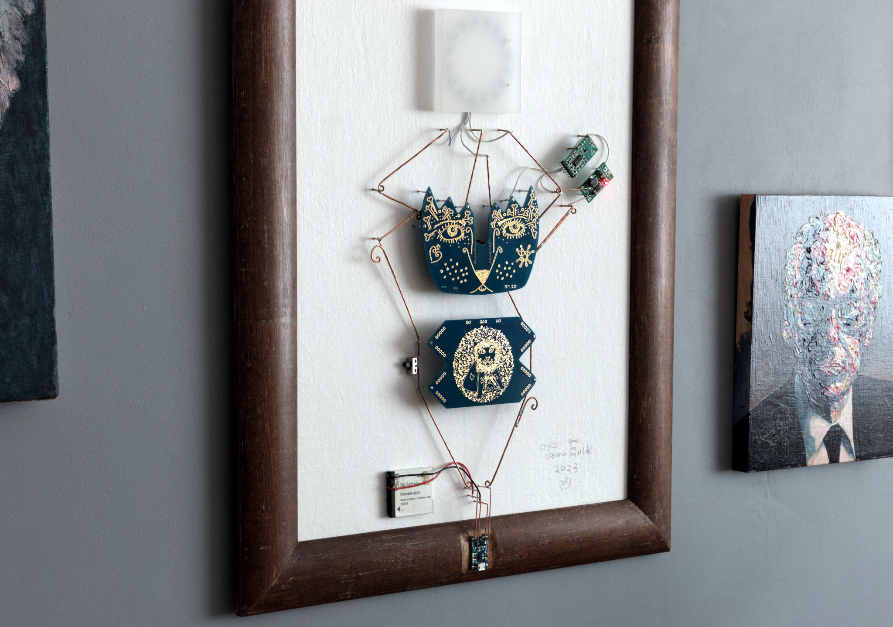
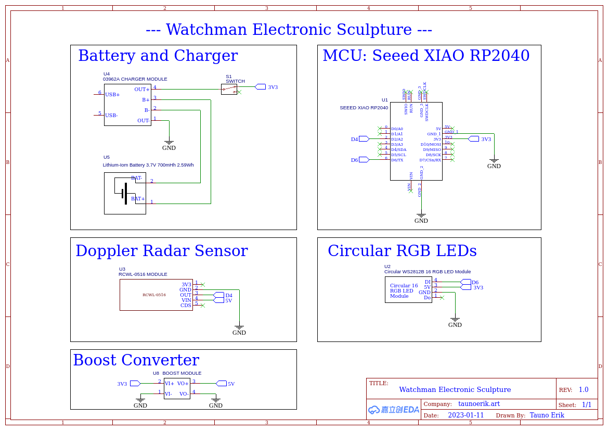
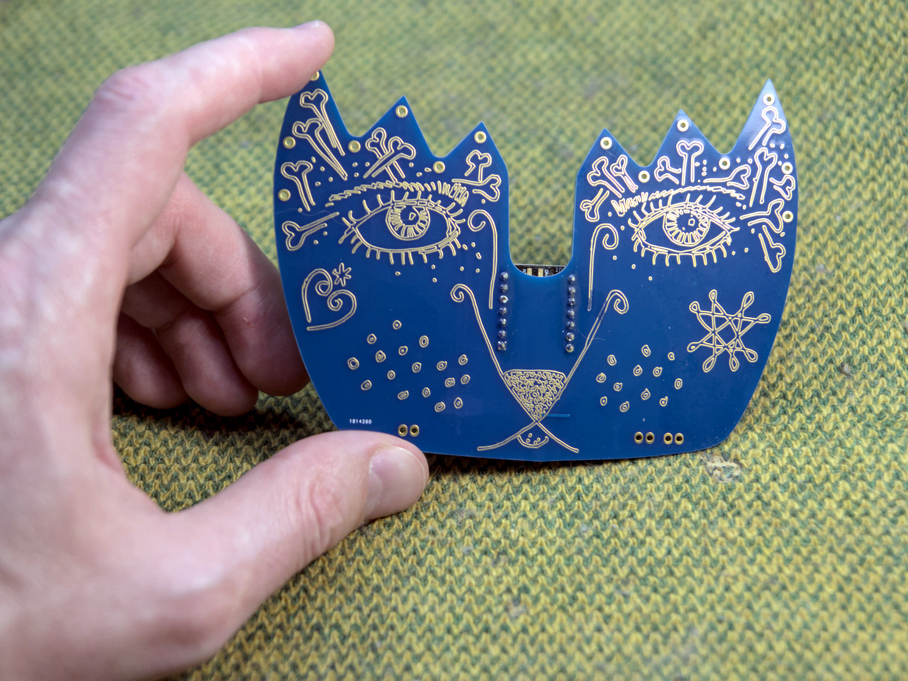
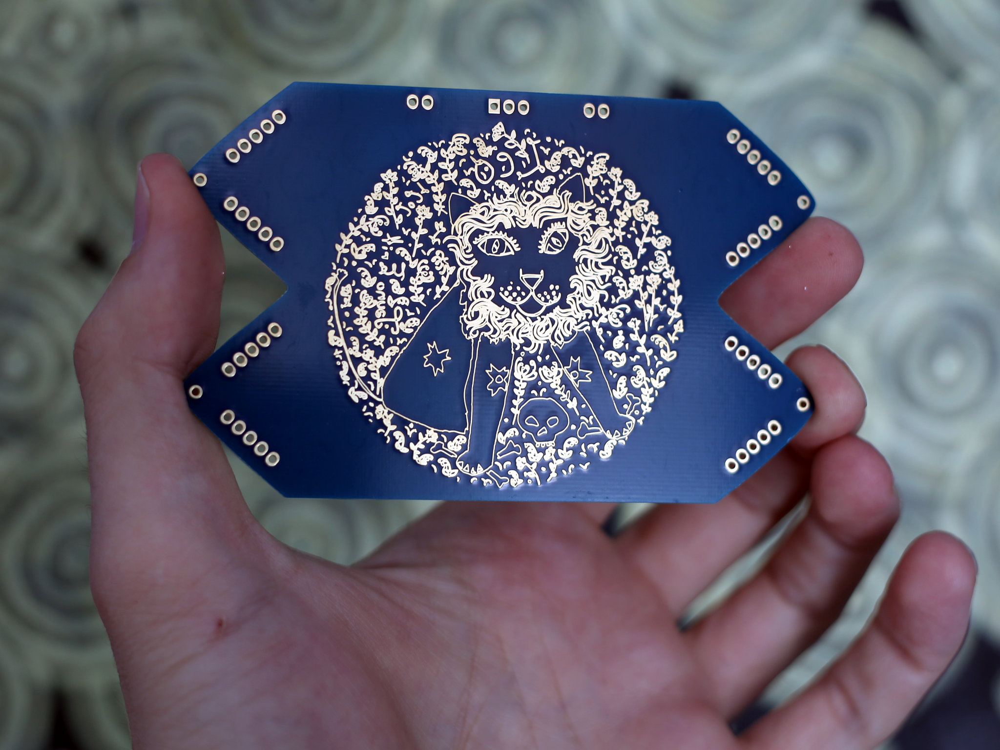

# The Watchman

The Watchman is an Electronic Sculpture.



The Watchman is an electronic wall sculpture that combines art, night lighting and security. The working principle is very simple. It all is built around of Seeed Xiao RP2040 microcontroller board. Powered by a 3.7v Lithium-ion battery. RCWL-0516 doppler radar sensor detects the motion and sends the signal to MCU. Because the sensor's working voltage is above 4 voltage, I added a voltage booster. When the MCU gets a signal, its lights up the circular RGB LEDs.

The outer dimensions are 440 x 590 mm.

## Hardware

- Seeed XIAO RP2040
- Lithium-Ion Battery 3.7V 700mHh 2.59Wh
- 03962A Battery Charger module
- RCWL-0516 Doppler Radar Sensor
- Circular WS2818B RGB LED 16 pc
- Boost Converter
- Custom PCBs
- Copper wire
- USB-C cable for programming
- Micro USB cable for battery charging

## Schematic

[Schematic (pdf)](Doc/Schematic_2023-Watchman_2023-01-11.pdf)



## Custom-Made PCBs

It has two custom-made PCBs. Both have my drawings on them. The face-shape one is kindly made by Seeed Studio Fusion service. It holds the MCU board and has all the input/output pins.





## Software

I have defined some colours for RGB LEDs:

```C
#define AMBER    255, 100, 0
#define AQUA     50, 255, 255
#define BLUE     0, 0, 255
#define CYAN     0, 255, 255
#define GOLD     255, 222, 30
#define GREEN    0, 255, 0
#define JADE     0, 255, 40
#define MAGENTA  255, 0, 20
#define OLD_LACE 253, 245, 230
#define ORANGE   255, 40, 0
#define PINK     242, 90, 255
#define PURPLE   180, 0, 255
#define RED      255, 0, 0
#define TEAL     0, 255, 120
#define WHITE    255, 255, 255
#define YELLOW   255, 150, 0
```

The rest of the code is on the GitHub repository.

___
2023 Tauno Erik
